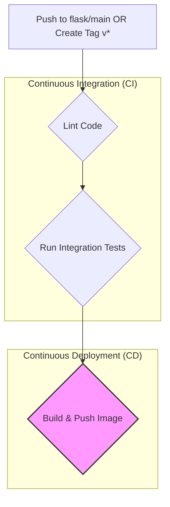

# Flask Application

[](https://github.com/taha2samy/fawry_graduation/actions/workflows/ci.yml)
[](https://codecov.io/gh/taha2samy/fawry_graduation)
[](https://hub.docker.com/r/taha2samy/fawry-flask-app)

A modern web application built with Flask for managing personal wishlists. This project is fully containerized with Docker and features a robust CI/CD pipeline for automated testing, quality assurance, and deployment to Docker Hub.

## Table of Contents

- [Features](#features)
- [Technology Stack](#technology-stack)
- [Project Architecture](#project-architecture)
- [Getting Started](#getting-started)
  - [Prerequisites](#prerequisites)
  - [Running Locally with Docker Compose](#running-locally-with-docker-compose)
- [Running Tests](#running-tests)
- [CI/CD Pipeline Visualization](#cicd-pipeline-visualization)
  - [Pipeline Flow Diagram](#pipeline-flow-diagram)
  - [Pipeline Triggers](#pipeline-triggers)
- [Project Structure](#project-structure)
- [API Endpoints](#api-endpoints)
- [Contributing](#contributing)
- [License](#license)

## Features

- **User Authentication**: Secure user sign-up, sign-in, and session management.
- **Wishlist Management**: Full CRUD (Create, Read, Update, Delete) functionality for wishlist items.
- **RESTful API**: A JSON-based API for retrieving user wishes.
- **Containerized Environment**: Fully dockerized application and database for consistent environments.
- **Automated CI/CD**: GitHub Actions pipeline for automated linting, testing, and image publishing.

## Technology Stack

- **Backend Framework**: [Flask](https://flask.palletsprojects.com/)
- **Database**: [MySQL 8.0](https://www.mysql.com/) (using the custom `taha2samy/mysql` image)
- **Containerization**: [Docker](https://www.docker.com/) & [Docker Compose](https://docs.docker.com/compose/)
- **CI/CD Platform**: [GitHub Actions](https://github.com/features/actions)
- **Testing**: [Pytest](https://pytest.org/) for integration tests & [Pytest-Cov](https://pytest-cov.readthedocs.io/) for coverage.
- **Code Quality**: [Flake8](https://flake8.pycqa.org/) for linting.

## Project Architecture

The application follows a simple two-tier architecture, containerized for portability and scalability:
1.  **Flask Web Server**: A container running the Python Flask application, handling all business logic and API requests.
2.  **MySQL Database**: A separate container running the custom MySQL image, which comes pre-initialized with the application's schema and stored procedures.

Both services are orchestrated using Docker Compose for local development.

## Getting Started

### Prerequisites

Ensure you have the following installed on your system:
- [Docker](https://www.docker.com/get-started)
- [Docker Compose](https://docs.docker.com/compose/install/)
- [Git](https://git-scm.com/)

### Running Locally with Docker Compose

This is the recommended method for running the application locally.

1.  **Clone the repository:**
    ```bash
    git clone https://github.com/taha2samy/fawry_graduation.git
    cd fawry_graduation
    ```

2.  **Create an environment file:**
    Create a file named `.env` in the root directory and add the necessary environment variables for the database connection. The `docker-compose.yml` file will automatically load this.

    **`.env` file example:**
    ```env
    # Credentials for the database service
    MYSQL_USER=flask_user
    MYSQL_PASSWORD=flask_pass
    MYSQL_DATABASE=BucketList
    MYSQL_ROOT_PASSWORD=root_secret_password
    ```

3.  **Start the services:**
    Run the following command to build the images and start the containers in the background.

    ```bash
    docker-compose up --build -d
    ```

4.  **Access the application:**
    The Flask application will be available at `http://localhost:5002`.

To stop all running services, use:
```bash
docker-compose down
```

## Running Tests

Tests are written using `pytest` and can be run locally within the Docker container to ensure a consistent testing environment.

1.  Ensure the services are running with `docker-compose up`.
2.  Execute the `pytest` command inside the Flask application container:

    ```bash
    # Find your container name with `docker ps`
    docker exec <your_flask_container_name> pytest tests/ --cov=app
    ```

## CI/CD Pipeline Visualization

The CI/CD pipeline is the backbone of this project, ensuring code quality and automating the release process.

### Pipeline Flow Diagram

This Mermaid diagram illustrates the stages and dependencies of our GitHub Actions workflow.



### Pipeline Triggers

-   **On `push` to `flask/main`**: The `lint` and `test` jobs are executed to validate the code. The `build-and-push` job is skipped.
-   **On `push` of a `tag` (e.g., `v1.0.0`) on the `flask/main` branch**: All jobs (`lint`, `test`, and `build-and-push`) are executed, resulting in a new Docker image being published to Docker Hub.

## Project Structure

```
.
├── .github/workflows/
│   └── ci.yml          # Main CI/CD workflow
├── tests/
│   └── test_app.py     # Pytest integration tests
├── app.py              # Main Flask application file
├── Dockerfile          # Dockerfile for the Flask application
├── docker-compose.yml  # Local development setup
├── requirements.txt    # Python dependencies
├── BucketList.sql      # Database schema (used by the DB image)
└── README.md
```

## API Endpoints

The application exposes several endpoints for user and wishlist management:

-   `POST /signUp`: Creates a new user.
-   `POST /validateLogin`: Authenticates a user and starts a session.
-   `GET /userHome`: Displays the authenticated user's wishlist page.
-   `POST /addWish`: Adds a new item to the user's wishlist.
-   `GET /getWish`: Retrieves all wishes for the authenticated user (JSON format).
-   `GET /logout`: Logs the user out.

## Contributing

Contributions are highly welcome! Please fork the repository and submit a pull request for any features, bug fixes, or improvements.

1.  Fork the repository.
2.  Create your feature branch (`git checkout -b feature/AmazingFeature`).
3.  Commit your changes (`git commit -m 'Add some AmazingFeature'`).
4.  Push to the branch (`git push origin feature/AmazingFeature`).
5.  Open a Pull Request.

## License

This project is distributed under the MIT License. See `LICENSE` for more information.
```
